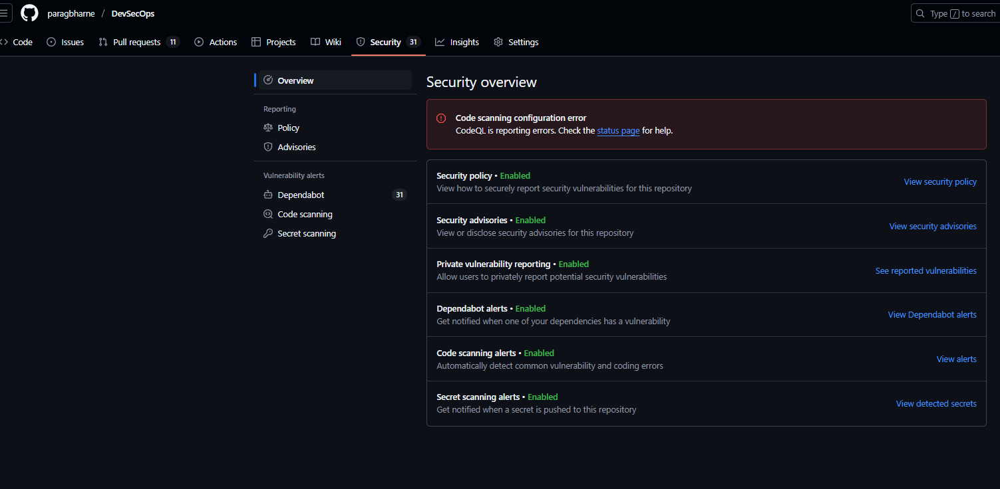
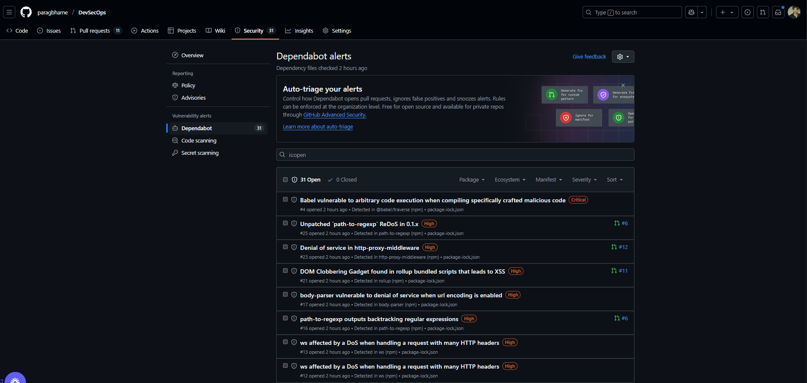
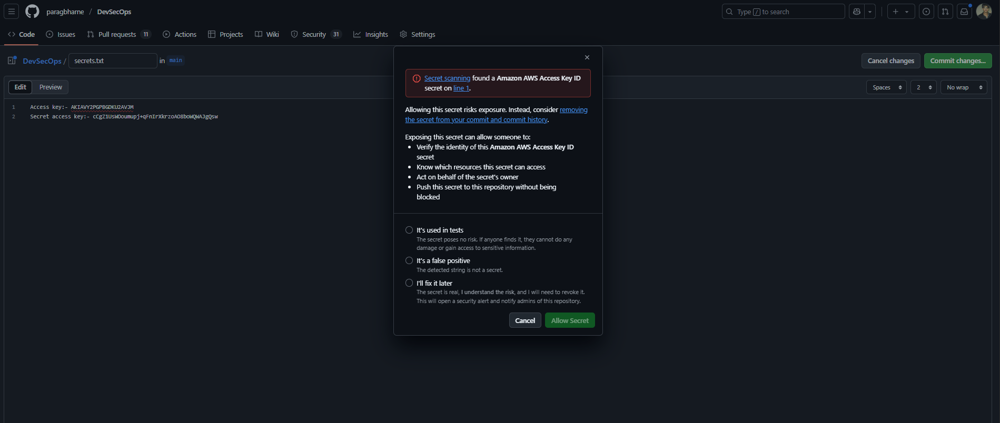
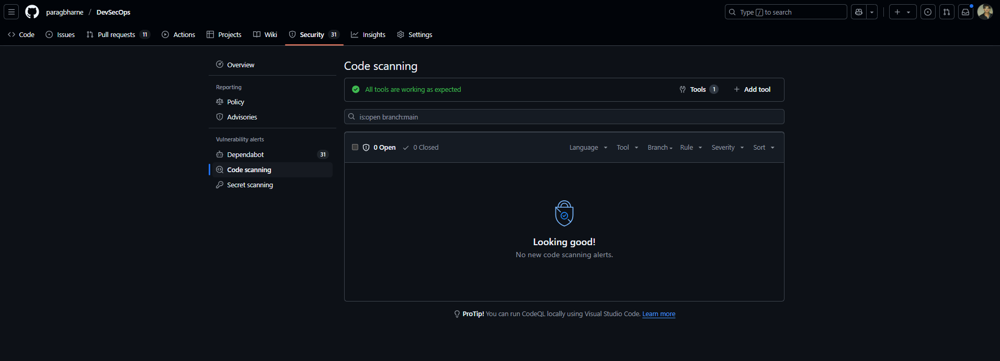

# 🔒 GitHub Advanced Security (GHAS) Integration – Documentation

---

## 🌟 1. Why Integrate GHAS?

In modern software development, security is a fundamental requirement. GitHub Advanced Security (GHAS) provides a comprehensive suite of tools to identify and mitigate vulnerabilities early in the development lifecycle. By integrating GHAS into our DevSecOps pipeline, we aim to:

- 🛠️ Detect and resolve security vulnerabilities in source code.
- 📦 Ensure dependency hygiene by identifying outdated or vulnerable packages.
- 🔑 Prevent accidental exposure of sensitive information like API keys or tokens.
- 📊 Centralize security alerts for better visibility and faster remediation.

---

## 🔍 2. Integration Details

### 🛠️ Tools Used:
1. **CodeQL**: A powerful static analysis tool to identify vulnerabilities in JavaScript/TypeScript code.
2. **Dependabot**: Automatically scans for outdated or vulnerable dependencies in `package.json` and `yarn.lock`.
3. **GitHub Secret Scanning**: Detects hardcoded secrets like API keys, passwords, and tokens in the repository.

### 🧪 Steps to Set Up:
1. **Repository Setup**:
   - 📂 Created a GitHub repository for a Node.js application.
   - 🧪 Pushed intentionally vulnerable code to test the integration.

2. **Code Scanning**:
   - 📝 Added a workflow file (`.github/workflows/codeql.yml`) to enable CodeQL scanning.
   - ⚙️ Configured CodeQL to analyze JavaScript/TypeScript files for vulnerabilities.

3. **Dependency Scanning**:
   - 🔄 Configured Dependabot using `.github/dependabot.yml` to scan:
     - Node.js dependencies (`npm`) daily.
     - Docker base images for vulnerabilities.

4. **Secret Detection**:
   - 🔑 Tested by committing a hardcoded API key.
   - 🚨 GitHub flagged the secret and triggered an alert, proving the feature works as expected.

---

## 📈 Results and Outcomes

1. **CodeQL Findings**:
   - 🛡️ Detected vulnerabilities like unsafe patterns and hardcoded strings in the source code.

2. **Dependabot Alerts**:
   - 📦 Identified outdated and vulnerable dependencies in `package.json` and `yarn.lock`.

3. **Secret Scanning**:
   - 🔒 Flagged hardcoded API keys and prevented them from being pushed to the repository.

4. **Security Dashboard**:
   - 📊 Provided a centralized view of all security alerts, making it easier to prioritize and resolve issues.

---

## 📊 3. Benefits and Challenges

### ✅ Benefits:
1. **Early Detection**:
   - 🕒 Vulnerabilities are identified at the commit or pull request stage, reducing the risk of introducing issues into production.

2. **Automation**:
   - 🤖 Scans are triggered automatically on every push, pull request, and schedule.

3. **Centralized Insights**:
   - 📋 All security alerts are visible in the GitHub Security Dashboard, simplifying tracking and resolution.

4. **Reduced Risk**:
   - 🔐 Early detection of secrets and CVEs prevents credential leaks and supply chain attacks.

5. **Seamless Integration**:
   - ⚡ Native to GitHub Actions, requiring no additional tools or agents.

### ⚠️ Challenges:

1. **False Positives**:
   - ❗ Some security warnings may require manual triage to determine their relevance.

2. **Strict Secret Detection**:
   - 🔑 Even test keys are flagged, requiring careful handling of test credentials.

---

## 🏁 4. Key Takeaways

After enabling GHAS and configuring the pipeline:

1. **Code Scanning**:
   - 🛡️ CodeQL detected several vulnerabilities, including unsafe patterns and hardcoded strings.

2. **Dependency Scanning**:
   - 📦 Dependabot flagged multiple outdated and vulnerable packages in `package.json`.

3. **Secret Detection**:
   - 🔒 GitHub blocked a test commit containing an API key and triggered an alert.

4. **Security Dashboard**:
   - 📊 Provided a centralized view of all security issues, making it easy to prioritize and resolve them.

This integration highlights the effectiveness of GHAS in enforcing security best practices and reducing risks in real-time.
