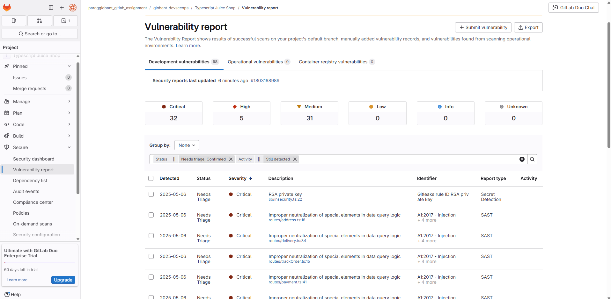
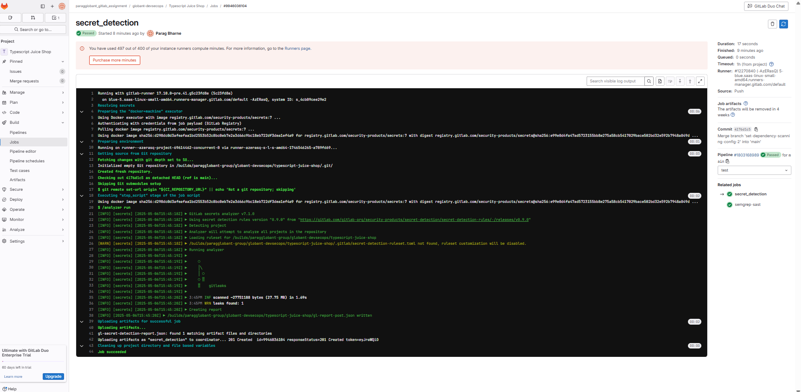

# GitLab Security Features

GitLab provides robust security features to help developers identify and mitigate vulnerabilities in their codebase. Below are some key features:

> **Note**: The steps mentioned here can be directly updated in your project. Alternatively, you can configure these features using the security configuration settings in GitLab.

## 1. SAST Scanning (Static Application Security Testing)
- **Description**: Analyzes source code to detect security vulnerabilities.
- **Key Benefits**:
    - Identifies issues early in the development lifecycle.
    - Supports multiple programming languages.
- **How to Enable**:
    - Add the `SAST` template to your `.gitlab-ci.yml` file:
        ```yaml
        include:
            - template: Security/SAST.gitlab-ci.yml
        ```


## 2. Secret Detection
- **Description**: Scans for hardcoded secrets like API keys, tokens, and passwords.
- **Key Benefits**:
    - Prevents accidental exposure of sensitive information.
    - Detects secrets in both committed code and merge requests.
- **How to Enable**:
    - Add the `Secret-Detection` template to your `.gitlab-ci.yml` file:
        ```yaml
        include:
            - template: Security/Secret-Detection.gitlab-ci.yml
        ```


## 3. Dependency Scanning
- **Description**: Identifies vulnerabilities in project dependencies.
- **Key Benefits**:
    - Monitors open-source libraries for known vulnerabilities.
    - Provides actionable remediation advice.
- **How to Enable**:
    - Add the `Dependency-Scanning` template to your `.gitlab-ci.yml` file:
        ```yaml
        include:
            - template: Security/Dependency-Scanning.gitlab-ci.yml
        ```

### Configuration:

```yaml
stages:
- security
- test

security:
    stage: security
    allow_failure: true
    trigger:
        include:
        - project: whitespots-public/pipelines
            ref: main
            file: pipelines.yml

sast:
    stage: test
include:
- template: Security/SAST.gitlab-ci.yml
- template: Security/Secret-Detection.gitlab-ci.yml
- template: Security/Dependency-Scanning.gitlab-ci.yml
```


## Additional Resources
- [GitLab Security Documentation](https://docs.gitlab.com/ee/user/application_security/)
- [GitLab CI/CD Templates](https://docs.gitlab.com/ee/ci/templates/)

## Conclusion
By leveraging these security features, we can enhance the security posture of your projects and ensure safer code delivery.